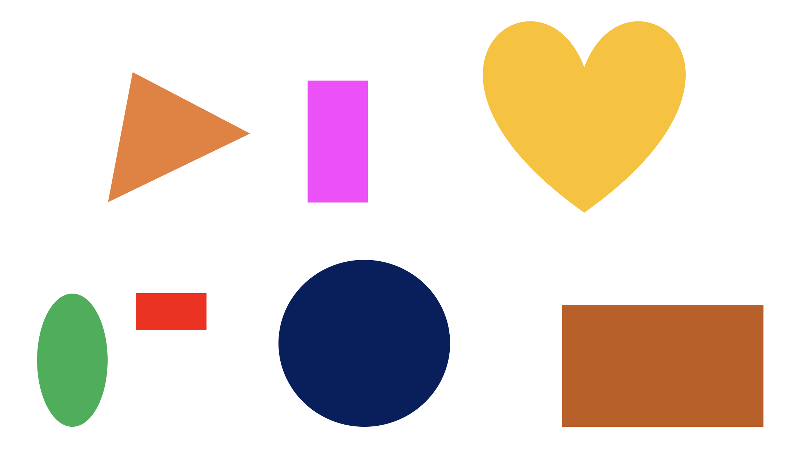
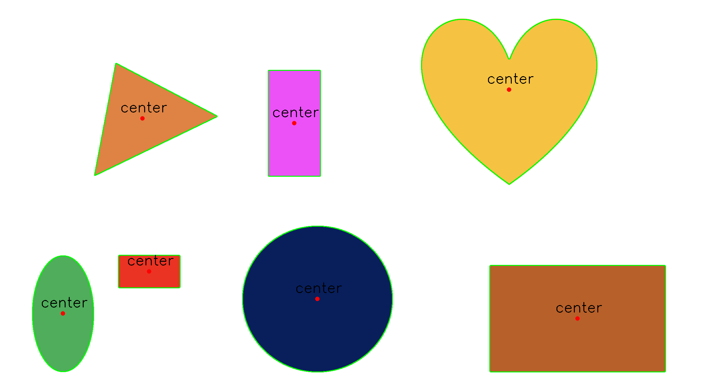

# Detect the center coordinates of shapes in Python.

> This repo is for detecting center coordinates of various type of shapes.  
<br/>


## Install


If you have manually installed module previously , you don't need to installation process.  
Otherwise, open the cmd and run the command to install it.


cv2 : 

```sh
pip install opencv-python
```

Matplotlib : 

```sh
pip install matplotlib
```

Numpy : 

```sh
pip install numpy
```


## Example

Here is an example on this project :

<br/>

<br/>
This example will detect the center coordinates various shapes<br/>
(Triangle, Circle, Oval, Square ... etc .)
<br/><br/><br/>


```
print("coordinates of centers:")
for i in contours:
    M = cv.moments(i)
    if M['m00'] != 0:
        cx = int(M['m10']/M['m00'])
        cy = int(M['m01']/M['m00'])
        cv.drawContours(image, [i], -1, (0, 255, 0), 1)
        cv.circle(image, (cx, cy), 7, (0, 0, 255), -1)
        cv.putText(image, "center", (cx - 70, cy - 20), cv.FONT_HERSHEY_SIMPLEX, 1.5, (0, 0, 0), 2)
        print(f"x: {cx} y: {cy}")
print("number of shapes detected: ", len(contours))

cv.imwrite("image.png", image)
```

Using cv2.moments() to calculate the moments from contour, and seek the center coordinates using the following formula.


<br/><br/>
Detect the center coordinates : 



## Limitatioins


It has some limitations of Boundary recongnition due to the setting boundary value of the shapes.  

It may occur a problem of poor-recognition in the case of light colors.


```sh
ret, thresh = cv.threshold(blur, 225, 255,cv.THRESH_BINARY_INV)
```

Currently, the threshold value is set to 225. It is necessary to closely adjust the value.


 
